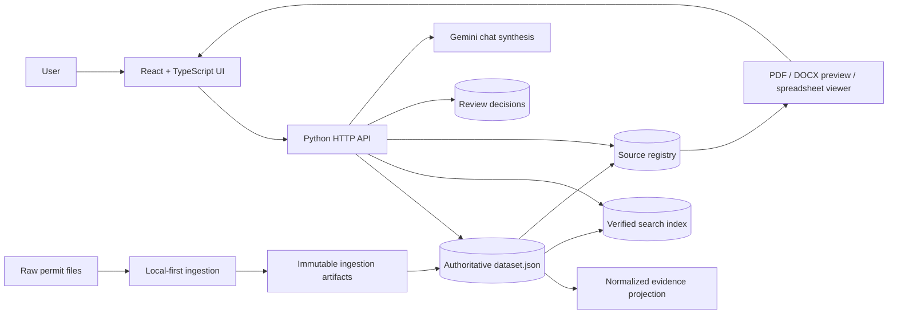
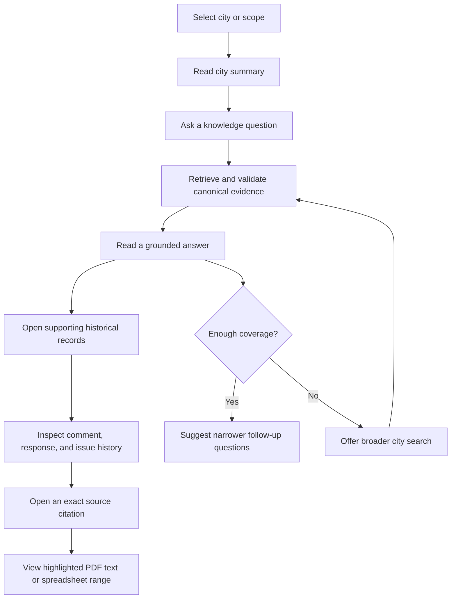
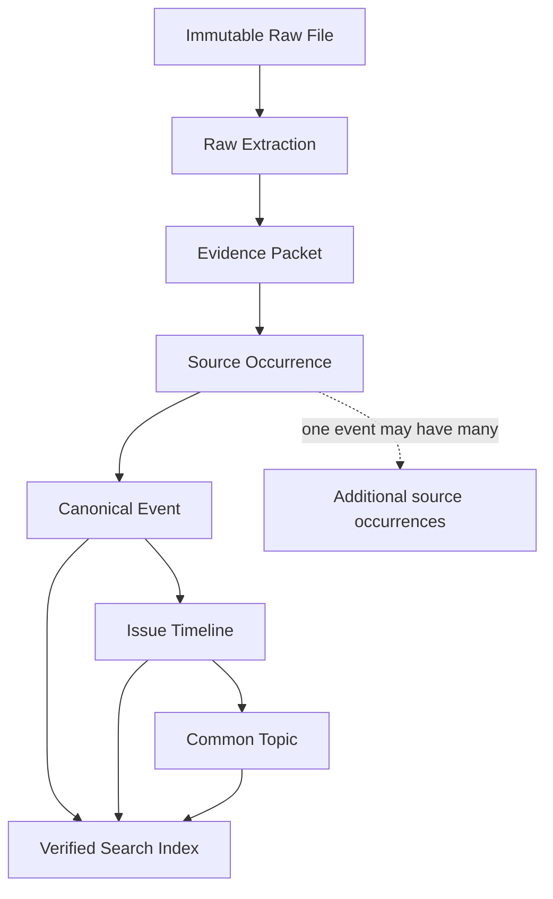
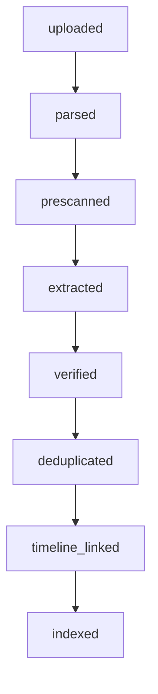
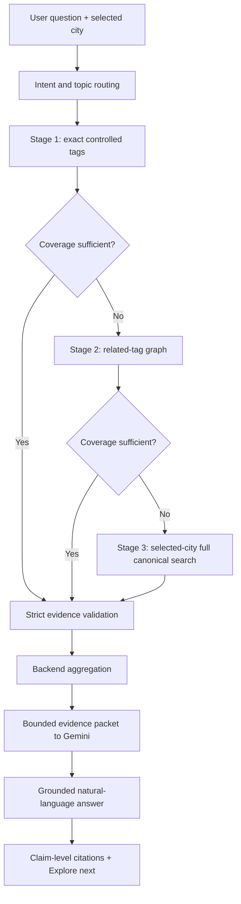

# Permit Precedents — Comment Response App

Permit Precedents is a source-grounded knowledge application for municipal permit-review history. It turns folders of government comments, applicant responses, reviewer follow-ups, PDFs, Word documents, spreadsheets, and CSV exports into a searchable history of what was requested, how the project team responded, whether the issue returned in a later review, and exactly where the evidence appears in the original file.

The application is designed for architects, engineers, permit coordinators, reviewers, and project managers who need to answer questions such as:

- What comments has a city raised on similar projects?
- How did the company respond to tree-protection, fire-separation, structural, planning, or drainage issues?
- Which requirements were repeated in PC1, PC2, and PC3?
- Which response was rejected or remained unresolved?
- Where is the exact sentence, table row, page, paragraph, sheet, or cell that supports the answer?
- Are several files showing separate comments, or several appearances of the same historical event?

The product combines four related views:

1. **Overview** — city-level counts, response coverage, common topics, and recurring issues.
2. **AI knowledge chat** — natural-language answers over verified historical evidence.
3. **Historical library** — searchable canonical comments with response and timeline filters.
4. **Source viewer** — in-app PDF, Word-preview, and spreadsheet evidence viewing without silently downloading files.

## Why this application is useful

The main value is not merely text extraction. The application preserves the difference between a file appearance, a real review event, a concrete issue that continues through multiple rounds, and a broad topic shared across projects.

### Key strengths

- **Evidence first.** Every usable statement retains a document, page/paragraph/cell locator, and exact evidence text.
- **Verbatim preservation.** Raw source text is immutable. Clean display text never replaces the original evidence.
- **Local-first ingestion.** Native PDF spans, Excel cells, DOCX paragraphs, tables, colors, and coordinates are parsed locally before Gemini is asked to resolve ambiguity.
- **Selective visual reasoning.** Gemini receives relevant whole-page images or targeted spreadsheet/document regions, not an entire project folder by default.
- **Two verification gates.** Pair verification checks comment-response correctness; coverage verification checks that no nearby comments or responses were missed.
- **Conservative confirmation.** A high confidence score alone cannot make a record confirmed.
- **Event-level deduplication.** One historical event appearing in three files becomes one event with three source occurrences.
- **Issue timelines.** Reissued requirements, applicant responses, and reviewer follow-ups are organized chronologically around one concrete design issue.
- **Common topics remain broad.** A topic such as Fire Separation can contain multiple distinct issue timelines without incorrectly merging them.
- **Strict chat relevance.** Off-topic records are excluded before Gemini writes an answer. Comparison answers require evidence from at least two relevant projects.
- **Progressive retrieval.** Chat begins with fast controlled tags, expands to related tags, and uses a city-scoped full search only when coverage is insufficient or the user explicitly asks to search more broadly.
- **Traceable repairs.** Raw extraction, normalized text, aliases, duplicate decisions, source occurrences, review decisions, checkpoints, and repair reports remain auditable.

## System overview

The browser is a React application built into static assets. A Python server serves the SPA and APIs. The ingestion pipeline is a separate local-first Python workflow. Gemini assists with prescan, ambiguous extraction, targeted verification, retrieval routing, evidence validation, and grounded answer synthesis; it is not the database and does not invent source locations.



### Main application workflow



## Authoritative data flow

The system deliberately separates evidence storage from user-facing grouping.



The layers mean:

| Layer | Meaning | What it must not be confused with |
| --- | --- | --- |
| Raw file | Original PDF, DOCX, XLSX, XLS, or CSV | Cleaned text or an AI rewrite |
| Raw extraction | Native parser output with spans, cells, paragraphs, styles, and coordinates | A confirmed comment |
| Evidence packet | Bounded context given to extraction/verification | The whole city dataset |
| Source occurrence | One place where an event appears in a file | A separate event merely because the file differs |
| Canonical event | One government comment, applicant response, or reviewer follow-up that happened once | Every duplicated export row |
| Issue timeline | Events about one concrete design issue at one project/site | A broad category |
| Common topic | A broad review aspect shared by distinct issues | A claim that comments are identical |
| Search record | Verified, search-eligible projection of canonical evidence | Raw or quarantined extraction |

## Technology stack

### Frontend

- React 19 and TypeScript
- Vite build pipeline
- Tailwind theme variables
- shadcn/ui-style primitives for cards, inputs, badges, dialogs, sheets, tabs, alerts, skeletons, and scroll areas
- AI Elements-style conversation, messages, prompt input, suggestions, citations, and loading states
- Adobe PDF Embed integration where available
- Read-only spreadsheet grid for XLS/XLSX/CSV sources

The frontend source is under `frontend/src/`. Production assets are built into `web_app/static/` and served by the Python server.

Important components include:

| File | Responsibility |
| --- | --- |
| `frontend/src/app.tsx` | Top-level layout, city scope, selection, and viewer state |
| `frontend/src/components/city-summary.tsx` | City overview, common topics, and recurring issue cards |
| `frontend/src/components/knowledge-chat.tsx` | Conversation UI, guided follow-ups, citations, and broad-search action |
| `frontend/src/components/history-results.tsx` | Searchable comment library and timeline-aware filters; categorization controls have been removed |
| `frontend/src/components/comment-detail.tsx` | Government comment, company response, source evidence, and chronological issue history |
| `frontend/src/components/source-viewer.tsx` | Viewer routing for PDF, preview documents, spreadsheets, and unsupported formats |
| `frontend/src/components/review-links-dialog.tsx` | Human review of uncertain response links |
| `frontend/src/components/workbook-review-dialog.tsx` | Workbook ingestion/review decisions |

### Backend

- Python standard-library HTTP server in `web_app/server.py`
- JSON-backed application data and registries
- Deterministic local filtering, aggregation, deduplication, timeline construction, and citation resolution
- Gemini API clients for Smart Search, Knowledge Chat, and ingestion tasks
- PyMuPDF/native document tooling and spreadsheet/DOCX parsers in the ingestion layer

The current architecture intentionally preserves the Flask/Python-style backend boundary: the React layer is presentation, while retrieval, trust, source authorization, ingestion, and citation logic stay on the server.

## Detailed data model

### Identity hierarchy

Every production record should resolve through stable identity fields:

```text
city_id
  └── site_id
        └── project_id / application_number
              └── document_id
                    └── source_occurrence_id

project/site
  └── canonical_event_id
        └── issue_thread_id
              └── common_topic_id
```

- `city_id` represents a normalized jurisdiction.
- `site_id` represents a normalized physical site/address.
- `project_id` or `application_number` represents the permit/project instance.
- `document_id` identifies a canonical document independently of its raw path.
- `source_occurrence_id` identifies a precise appearance in a document.
- `canonical_event_id` identifies what happened once.
- `issue_thread_id` links the same concrete issue through time.
- `common_topic_id` provides broad cross-project classification.

Project and site names are normalized before grouping so differences in capitalization, punctuation, ZIP formatting, permit prefixes, or address abbreviations do not split one project into two independent histories.

### Raw document

A raw document records the immutable input and its identity:

```json
{
  "document_id": "doc_123",
  "source_file_id": "file_123",
  "path": "comments&response/.../review-comments.pdf",
  "filename": "review-comments.pdf",
  "original_type": "pdf",
  "sha256": "...",
  "city_id": "san-jose",
  "site_id": "site_7298_queensbridge",
  "project_id": "25-031",
  "immutable": true
}
```

The hash prevents identical binaries from being reprocessed. Paths are internal and are never returned directly to the browser.

### Raw extraction

Raw extraction stores what the local parser observed before interpretation:

- PDF spans, lines, bounding boxes, page numbers, font properties, color, annotations, and candidate table regions
- spreadsheet workbook/sheet structure, cell addresses, values, formulas where relevant, styles, colors, merged cells, hidden rows/columns, and surrounding row context
- DOCX paragraphs, runs, numbering, tables, headings, styles, colors, headers, and footers
- CSV row/column values and headers

Three text representations are kept conceptually separate:

```json
{
  "text_raw": "Please provide the required\nfire separation...",
  "text_reconstructed": "Please provide the required fire separation...",
  "text_display": "Please provide the required fire separation...",
  "source_spans": [],
  "reconstruction_method": "local",
  "reconstruction_confidence": 0.98
}
```

- `text_raw` is evidence and is never rewritten.
- `text_reconstructed` removes layout artifacts for search, embedding, and deduplication.
- `text_display` is the readable frontend form. It may improve spacing and line breaks, but must not paraphrase the evidence.

### Evidence packet

An evidence packet is the smallest useful context sent to Gemini or deterministic verification. It can contain a full relevant page image, native extracted text, the candidate region, nearby context, and known structure.

```json
{
  "document_id": "doc_123",
  "file_type": "pdf",
  "page": 4,
  "document_date": "2026-03-16",
  "context_before": "...",
  "candidate_comment": {
    "text": "...",
    "bbox": [100, 220, 720, 410],
    "color": "#111111"
  },
  "candidate_response": {
    "text": "3/16/2026: complete.",
    "bbox": [100, 420, 720, 500],
    "color": "#9d279d"
  },
  "source_round_label": "PC2",
  "image_required": true
}
```

For visually meaningful PDFs, the normal visual unit is a relevant whole page, not the whole document. For spreadsheets, the complete workbook is parsed locally while Gemini receives a relevant continuous region with headers and adjacent columns/rows.

### Source occurrence

A source occurrence stores one exact physical appearance:

```json
{
  "source_occurrence_id": "occ_456",
  "owner_type": "canonical_event",
  "owner_id": "event_789",
  "role": "government_comment",
  "document_id": "doc_123",
  "page": 4,
  "locator": {
    "viewer_type": "pdf",
    "bounding_boxes": [[100, 220, 720, 410]],
    "exact_quote": "...",
    "normalized_quote": "..."
  },
  "date": {
    "value": "2026-03-16",
    "source": "response_text",
    "raw_text": "3/16/2026",
    "confidence": 1.0
  },
  "round": {
    "value": "PC2",
    "source": "document_header",
    "confidence": 0.99
  }
}
```

Spreadsheet locators preserve `sheet_name` and `cell_range`; DOCX locators preserve paragraph/table references and optional preview-page mappings.

### Canonical event

A canonical event is the only unit allowed directly in an issue timeline. Its `event_type` is one of:

- `government_comment`
- `applicant_response`
- `reviewer_follow_up`
- another explicitly modeled review-history event

```json
{
  "canonical_event_id": "event_789",
  "event_type": "government_comment",
  "site_id": "site_2311_warner_range",
  "project_id": "25-001",
  "city_id": "menlo-park",
  "exact_text": "Please provide ...",
  "normalized_text": "please provide ...",
  "effective_round": "PC2",
  "observed_in_document_rounds": ["PC2", "PC3"],
  "event_date": "2025-08-20",
  "source_occurrence_ids": ["occ_1", "occ_2"],
  "status": "confirmed",
  "search_eligible": true
}
```

`effective_round` describes when the requirement actually occurred. `observed_in_document_rounds` describes later documents that copied or repeated it. A PC1 comment copied into a PC4 response letter remains one PC1 event with another occurrence; it does not become a new PC4 comment.

### Comment-response link

Links are stored independently of immutable comment text:

```json
{
  "comment_id": "comment_123",
  "response_id": "response_456",
  "match_status": "confirmed",
  "match_method": "same_pdf_form_row",
  "match_confidence": 1.0,
  "provenance": "document_structure_rematch",
  "comment_locator": {},
  "response_locator": {},
  "conflict": false
}
```

Exact application/round/comment identifiers and visible same-row structure take priority over semantic similarity. Conflicting confirmed links are never silently overwritten.

### Confidence and confirmation

Confidence is split by concern:

```json
{
  "status": "confirmed",
  "transcription_confidence": 0.99,
  "pairing_confidence": 0.96,
  "date_confidence": 0.91,
  "round_confidence": 0.94,
  "role_confidence": 0.98
}
```

The confirmation gate requires all applicable evidence conditions:

```text
original text exists
+ source location exists
+ verbatim verification passed
+ pair verification passed
+ coverage verification passed
+ no conflicting record
+ date or round meets the minimum provenance requirement
```

Confidence helps rank review work. It is not sufficient by itself to mark a record confirmed.

### Issue timeline

An issue timeline groups the same concrete design issue at one site/project:

```json
{
  "issue_thread_id": "MP-TL-001",
  "project_id": "25-001",
  "title": "ADU/main-dwelling fire-rated wall assembly",
  "common_topic_id": "fire-separation",
  "status": "open",
  "first_round": "PC1",
  "latest_round": "PC3",
  "event_ids": ["event_1", "event_2", "event_3"]
}
```

Relationships between events can include:

- `exact_reissue`
- `reissued_with_clarification`
- `requirement_modified`
- `response_rejected`
- `partially_resolved`
- `resolved`
- `uncertain`

A recurring issue must contain more than a single comment or a single comment-response pair. Repeated source files alone do not make an issue recurring.

### Common topic

A common topic answers, “What broad design or review aspect do these issues concern?” It does not mean the requirements are identical.

```text
Common Topic: Fire Separation
├── Issue: ADU/main-dwelling rated wall assembly
└── Issue: Fire-separation detail cross-references
```

Topic frequency counts distinct issue timelines, not source occurrences or repeated round events. Requirements with materially different parameters remain distinct even when they share a topic—for example, a 3-foot door requirement and a 4-foot door requirement can share a Door Dimensions topic but must not become the same event or issue.

## How data is stored

The current application uses versioned JSON as its authoritative operational store, plus derived JSON/CSV artifacts. A future relational migration can preserve the same entities, but it is not required for the current app to function.

### Storage map

| Path | Format | Role | Authoritative? |
| --- | --- | --- | --- |
| `comments&response/` | Original PDF/DOCX/XLS/XLSX/CSV files | Private production source corpus | Authoritative source evidence |
| `demo_sources/` | Small synthetic files | Public/demo source corpus | Demo only |
| `phase2_dataset/dataset.json` | Versioned JSON object | Main application dataset: comments, responses, links, sources, canonical documents, aliases, issue-event index, review queues, metadata, and repair history | **Yes, for current runtime data** |
| `phase2_dataset/evidence_model.json` | Versioned JSON object | Deterministic normalized projection: raw documents, raw extractions, evidence packets, source occurrences, canonical events, issue timelines, common topics, checkpoints | Derived from dataset/artifacts |
| `phase2_dataset/ingestion_artifacts/<id>/raw_text.json` | JSON | Immutable local parser output | Audit evidence |
| `phase2_dataset/ingestion_artifacts/<id>/evidence_packet.json` | JSON | Context selected for extraction/verification | Audit evidence |
| `phase2_dataset/ingestion_artifacts/<id>/gemini_extraction.json` | JSON | Structured Gemini extraction result | Audit evidence; not automatically trusted |
| `phase2_dataset/ingestion_artifacts/<id>/gemini_verification.json` | JSON | Pair and coverage verification result | Audit/confirmation input |
| `phase2_dataset/pipeline_checkpoint.json` and checkpoint fields | JSON | Stage state, request identity, model/prompt/parser versions, retry state | Operational state |
| `web_app/data/source_registry.json` | JSON dictionaries keyed by document/source ID | Runtime mapping from safe source IDs to authorized documents and normalized viewer locations | Runtime authoritative registry |
| `phase2_dataset/source_registry.json` | JSON | Ingestion/export registry artifact used by migration and repair tooling | Derived; may differ from runtime registry until rebuilt |
| `web_app/data/search_index.json` | JSON records + embeddings/metadata | Verified canonical search projection | Derived and rebuildable |
| `phase2_dataset/search_index.json` | JSON | Phase-2 search artifact/export | Derived |
| `web_app/data/gemini_enrichment.json` | JSON keyed enrichment cache | Cached titles, normalized display fields, and semantic enrichment | Derived/cache |
| `web_app/data/link_review_decisions.json` | JSON | Human decisions for uncertain comment-response links | Authoritative review input |
| `web_app/data/workbook_review_decisions.json` | JSON | Human review decisions for workbook ingestion | Authoritative review input |
| `web_app/data/category_assignments.json` | JSON | Legacy persisted category metadata | Compatibility only; category UI is currently removed |
| `phase2_dataset/comments.csv` | CSV | Flat comment export for review/reporting | Derived, not the database |
| `phase2_dataset/responses.csv` | CSV | Flat response export | Derived |
| `phase2_dataset/comment_response_links.csv` | CSV | Flat link export | Derived |
| `phase2_dataset/extraction_review.csv` | CSV | QA/review queue export | Derived workflow artifact |
| `phase2_dataset/ingestion_report.json` | JSON | Run totals, failures, timing, and ingestion decisions | Report |
| `phase2_dataset/prescan_plan.json` and preflight reports | JSON | Files/pages/sheets selected or excluded before full extraction | Report/checkpoint input |
| `phase2_dataset/*timing*.json` | JSON | Request and stage telemetry | Report |
| `phase2_dataset/*failed*.*` | JSON/CSV | Failed files/pages and reasons | Review/retry input |
| `phase2_dataset/dataset.pre-*.json` | JSON | Pre-repair snapshots | Backup only; never loaded as the active dataset |
| `web_app/data/search_eval_v1.json` | JSON | Provisional retrieval evaluation cases | Test fixture |
| `web_app/data/search_eval_unseen_v1.json` | JSON | Unseen/provisional evaluation cases | Test fixture |

### Main dataset structure

`phase2_dataset/dataset.json` currently contains top-level collections such as:

```text
comments
responses
comment_response_links
source_files
sources
canonical_documents
source_file_aliases
source_lineage_groups
processed_source_hashes
processed_source_paths
issue_event_index
issue_event_aliases
issue_event_review_queue
review_items
review_decisions
near_duplicate_review
repair_history
evidence_model
metadata
```

The exact counts change after ingestion and repair. At the time of this documentation update, the local production dataset contained approximately 2,327 comments, 528 responses, 2,327 comment-response link rows, 114 physical source files, 106 canonical documents, and 1,685 issue-event threads. These are operational counts, not all “verified useful comments”; trust and `search_eligible` gates determine what reaches formal search and AI answers.

### Normalized evidence projection

`phase2_dataset/evidence_model.json` is generated by `phase2/evidence_model.py`. It provides a clearer entity-oriented projection without rewriting the legacy-compatible dataset:

```text
raw_documents
raw_extractions
evidence_packets
source_occurrences
canonical_events
issue_timelines
common_topics
checkpoints
stages
```

The projection is deterministic and does not call Gemini. It exists to make migration, auditing, tests, and future database work safer.

## Ingestion pipeline

The ingestion design is:

> Local-first → Evidence Packet → Selective Vision → Targeted Verification

### Stage sequence



Each stage records its version and checkpoint. Changing timeline logic should rerun dedup/timeline/indexing, not re-upload every page to Gemini.

### 1. File registration and audit

The audit layer inventories supported files, calculates SHA-256 hashes, records path/folder metadata, proposes city/site/project/round classifications, and identifies exact duplicate binaries. `corpus_audit/audit_corpus.py` is read-only: it does not OCR, extract comments, or call Gemini.

### 2. Native local parsing

The parser extracts all structure it can recover cheaply and exactly.

#### PDF

- text spans and reading coordinates
- page number and bounding boxes
- font size/style/color when available
- annotations and table-like regions
- repeated header/footer candidates
- column boundaries and line spacing

Local text reconstruction joins forced line breaks when font, size, color, x-position, vertical spacing, and column membership indicate one paragraph. It preserves bullets, numbering, paragraph boundaries, sheet references, codes, measurements, and negation.

#### Excel/XLSX/XLS

- every sheet and sheet name
- row/column coordinates and cell addresses
- values and relevant formulas
- merged cells, hidden structures, style and color
- complete same-row context and surrounding rows
- comment, response, discussion, cycle, status, reviewer, and date columns where present

The complete workbook is read locally. Gemini receives selected continuous regions with headers and context, not a single giant workbook screenshot.

#### DOCX

- paragraphs, runs, numbering, and styles
- tables and merged cells
- headings, headers, and footers
- run-level color and formatting
- paragraph/table indices for citations

LibreOffice is optional for PDF preview generation, not the only text extractor. When it is unavailable, the original evidence is retained and the viewer reports `preview_unavailable`.

#### CSV

- complete row/column structure
- headers and typed values where inferable
- stable row/cell locators

### 3. Prescan

Local rules plus Gemini Flash-Lite determine:

- whether the file contains government comments, applicant responses, both, a plan, or irrelevant material
- which pages, sheets, or regions may contain evidence
- whether dates, rounds, IDs, response columns, colors, or discussion history are present
- whether native extraction is reliable or a visual page is needed

Prescan is tuned for high recall. It saves time by excluding obvious plan/specification files that contain no review history, but ambiguous material is retained rather than silently skipped.

### 4. Evidence packet construction

Relevant native text, page/region images, neighboring context, table headers, cell addresses, colors, and preliminary date/round clues are packaged with stable IDs. The source registry, not Gemini, generates file links and citation locators.

### 5. Gemini extraction

The extraction model is currently configured for `gemini-3.6-flash`; prescan defaults to `gemini-3.1-flash-lite`.

The extraction prompt contract requires Gemini to:

- understand visible table rows, headings, numbering, columns, colors, and spatial relationships
- return government comment, applicant response, and reviewer follow-up as separate event roles
- transcribe exactly as written
- identify explicit dates, rounds, submissions, comment IDs, and reviewer/applicant names
- treat colored or dated inline text such as `3/16/2026: complete.` as a separate response/status event when the structure supports it
- mark uncertainty and explain it
- never summarize, paraphrase, correct, combine, omit, or invent source links/locations

A simplified prompt shape is:

```text
You are reading a bounded evidence packet from one permit-review source.

Return structured JSON for every visible government comment, applicant response,
and reviewer follow-up. Preserve text verbatim. Use the supplied source IDs and
locators only. Do not invent pages, links, dates, rounds, or pairings.

Use table-row, comment ID, headings, color, and spatial structure to assign roles.
If a value is uncertain, return uncertain=true and explain why.
```

### 6. Pair and coverage verification

Verification is a separate pass over the original evidence packet, relevant page image/region, native text, and extracted JSON.

It checks:

- every visible comment was captured
- every visible response/follow-up was captured
- transcription is complete and verbatim
- comment-response pairing follows the same visible row, shared printed ID, or explicit relationship
- no preceding/following row leaked into the event
- date and round provenance are supported
- no event fragment was duplicated

Pair verification and coverage verification must both pass before the record can become confirmed.

### 6a. Verbatim reconstruction and bounded correction

The extraction layer keeps the exact source representation separate from its
readable representation. Records may contain `text_raw`,
`text_reconstructed`, `display_structure`, `normalized_identity_text_v2`,
`normalized_search_text_v2`, generalized `source_unit_ids`, and versioned
`reconstruction` provenance. The reconstructed text is lexical-preserving: it
can join artificial line wraps, normalize whitespace, remove proven export
noise, and restore list/paragraph structure, but it cannot paraphrase,
correct wording, change numbers/codes/negations, or merge roles. The
presentation-only `display_structure` never participates in event identity,
pairing, deduplication, timeline ordering, search identity, or topic grouping.

If the independent verifier reports only a layout/reconstruction defect, a
single bounded correction request may propose a replacement representation.
The backend accepts it only when the words, numbers, and punctuation have the
same lexical signature as the exact source text, then runs verification again.
Missing records, incorrect pairings, dates, or locators remain
`needs_review`; they are never guessed into place.

Existing canonical data is migrated separately and additively. The resumable
backfill preserves all legacy fields and writes a complete non-regression
snapshot before/after relationship map:

```sh
python3 phase2/reconstruct_existing.py \
  --dataset phase2_dataset/dataset.json \
  --output phase2_dataset/dataset.reconstructed.json
```

The command fails if canonical IDs, issue IDs, comment-response links, dates,
rounds, source occurrence IDs/locators, or ordered timeline arrays change. It
does not call Gemini or merge duplicate events; duplicate candidates remain a
separate, explicitly reviewed repair operation.

### 7. Date and round provenance

Dates and rounds are values with evidence, not loose strings. Date priority is:

```text
explicit response/comment text
> table date
> document header/body
> PDF/DOCX metadata or letter date
> filename-derived date
> unknown
```

Explicit content wins over filenames. A filename containing `PC2` cannot override a visible `PC3` label. Document date, event date, response date, and file-export date remain separate so a later workbook export does not reorder an older comment.

### 8. Deduplication

Deduplication occurs before timeline construction and applies to comments, responses, and reviewer follow-ups.

The normalizer removes harmless differences such as:

- `*x000d*`, `_x000d_`, forced line breaks, repeated whitespace
- duplicated `PC1:`/markup/export prefixes
- capitalization and punctuation noise
- OCR spacing and line-wrap differences
- duplicated filename or “Markup … V1-C1 …” wrappers

It preserves meaningful differences such as:

- numbers and measurements
- code sections
- sheet/detail references when they identify a requirement
- negation (`not`, `no`, `without`, etc.)
- materially different objects or conditions

The canonical fingerprint uses stable identity and semantics, approximately:

```text
site/project
+ event type/actor role
+ effective round and event date where reliable
+ printed comment ID/markup identity where reliable
+ normalized body text
+ parameter tokens
+ negation tokens
```

Decisions are:

- `AUTO_MERGE` — same event; union all source occurrences and labels
- `SUSPECTED_DUPLICATE` — plausible duplicate requiring review
- `DISTINCT` — separate event or reissue

Duplicate rows are not destroyed. They receive `duplicate_of=<canonical_id>` and `search_eligible=false`; their document/page/cell locations move under the surviving canonical event.

Within one timeline, same-role events on the same date with highly similar normalized content are force-collapsed conservatively. Their labels, submissions, IDs, and unique source occurrences are unioned. Different technical parameters or negation prevent the merge.

### 9. Timeline linking

Timelines are built from canonical event IDs only. They begin with the main government comment, then order responses and reviewer follow-ups by the earliest reliable event date. Unknown-date events are placed using supported round/submission ordering without manufacturing a date.

The app distinguishes:

- a comment copied into another file — one event, another source occurrence
- an exact requirement repeated in a later round — a later reissue event in the same timeline
- a changed requirement — a related but distinct event with `requirement_modified`
- two broad-topic comments with different design objects or parameters — different issue timelines

### 10. Verified indexing

Only confirmed, canonical, `search_eligible=true`, non-conflicting records enter the formal search index. Unchanged searchable text reuses its existing embedding; it is not re-embedded merely because unrelated metadata changed.

## Checkpointing, retries, and telemetry

The pipeline records stage-level checkpoints rather than a single `processed=true` flag. Request identity includes stable document/evidence/prompt/model inputs, so restarts can reuse completed work.

Operational telemetry can include:

- `request_created_at`
- `upload_duration`
- `queue_duration`
- `time_to_first_token`
- `generation_duration`
- `input_tokens`
- `cached_input_tokens`
- `output_tokens`
- `image_count`
- `image_resolution`
- `evidence_unit_count`
- `expected_record_count`
- `actual_record_count`
- `response_bytes`
- `retry_count`
- `finish_reason`

A credits/429 circuit breaker stops aggressive resubmission when quota is unavailable. Completed page batches remain checkpointed. Requests with unknown completion state are not automatically duplicated, which prevents accidental double billing.

## Search and AI Knowledge Chat

AI Chat operates only over the cleaned knowledge base. It does not reread PDFs, rerun OCR, repair records, or rebuild timelines during a normal user question.

### Chat data path



### The dataset is not sent with every question

The server does not send an entire city dataset to Gemini at session start or on every turn. That would be expensive, slow, difficult to cite, and vulnerable to context loss.

Instead:

1. The server searches local tags, text, metadata, and embeddings.
2. It filters to verified canonical events in the selected city.
3. It validates topic relevance and intent-specific coverage.
4. It computes counts, projects, rounds, response coverage, and timeline facts locally.
5. It sends only a bounded evidence packet and computed facts to Gemini.
6. Gemini explains those facts and attaches only the supplied citation IDs.

Conversation state keeps the previous query, scope, evidence set, and guided actions so follow-ups can refine the current result without resending unrelated history.

### Intent modes

The backend internally recognizes:

- **Lookup** — a specific project, requirement, sheet, code, or comment
- **Comparison** — differences across projects; requires at least two validated projects
- **Timeline** — how one concrete issue changed through review rounds
- **Analysis/Summary** — common patterns, repeated issues, response coverage, or counts

### Progressive topic retrieval

Stage 1 uses exact controlled tags. Stage 2 expands through a curated topic graph. For example:

```text
fire_separation
├── rated_assembly
├── exterior_wall_rating
├── opening_protection
├── garage_separation
└── dwelling_unit_separation
```

Stage 3 performs hybrid keyword/metadata/semantic search over the **selected city’s** full verified canonical corpus. It is triggered automatically when coverage is insufficient or by the user’s “Search broader history” action. The UI warns that the broader search can take longer.

### Coverage rules

Coverage depends on the question:

| Intent | Minimum useful coverage |
| --- | --- |
| Lookup | At least one relevant validated event |
| Comparison | At least two relevant projects |
| “How have we handled X?” | Relevant issues plus at least one confirmed response |
| Summary | Enough distinct issues/events/projects to support a pattern |
| Timeline | At least two meaningful canonical events |

If the gate fails, the assistant says evidence is insufficient rather than producing a confident answer from unrelated records.

### Strict relevance gate

Every retrieved candidate is checked against the requested concept. A grading/drainage record cannot support a fire-separation answer merely because its embedding is nearby.

The validator produces a decision similar to:

```json
{
  "requested_topic": "fire separation",
  "record_topic": "grading and drainage permit",
  "is_relevant": false,
  "exclude_reason": "Evidence does not concern fire separation."
}
```

Only validated records can support a claim or show the “Source grounded” label.

### Chat prompt contract

The current Knowledge Chat model defaults to `gemini-3.6-flash`. The prompt supplies:

- user question and selected city/scope
- classified intent and requested concepts
- backend-computed counts and coverage status
- a bounded list of verified evidence records with stable citation IDs
- any prior conversation focus required for the follow-up
- explicit excluded-record reasons where useful

The model is instructed to:

- answer naturally and directly before showing supporting detail
- use only the supplied verified evidence
- never invent counts, project IDs, links, source locations, or resolution states
- distinguish reviewer requirements from applicant actions
- cite claims using supplied source IDs
- state limitations when comparison or response coverage is insufficient
- suggest useful broad-to-specific next questions
- never promote `probable` or `needs_review` evidence into a formal conclusion

The database/server—not Gemini—calculates counts, response rates, project counts, round counts, repeated occurrences, and exact source locations.

### Suggested follow-ups

After a broad question, the assistant offers constrained “Explore next” actions such as:

- narrow to a specific project
- compare two projects
- inspect the longest-running issue
- show confirmed company responses
- open the cited timeline
- search broader history in the selected city

These actions are allowlisted server operations, not arbitrary model-generated API calls.

## Historical library organization

The history list shows one library item per canonical record or related issue set. It does not intentionally sort all records as a ranking report; the overview’s recurring-issue section, however, prioritizes timelines with more useful history (more meaningful events/rounds/responses) before simple histories.

The list supports:

- keyword/code/sheet/question search
- city/project/discipline/round/response/review-state filters
- timeline-aware filtering
- selecting a record and centering its detail view
- colored response-state labels such as confirmed response, missing response, or unverified response

The old manual category filter and bulk categorization control were removed from the UI. Legacy category metadata remains only for compatibility and controlled topic indexing.

## Source viewer

Clicking a citation opens an in-app viewer. It never silently downloads the source.

### PDF

- open inline with the Adobe PDF Embed viewer where available
- navigate to the cited page
- prefer stored bounding boxes/coordinates for highlighting
- fall back to exact-text search when coordinates are unavailable
- use normal zoom by default; targeted zoom exceptions exist only for known dense Menlo Park review-table PDFs where normal fit makes the evidence unreadable

### DOC/DOCX

- preserve the original document
- generate a replaceable PDF preview when LibreOffice headless is available
- map paragraph/table evidence to preview pages
- show `preview_unavailable` rather than initiating a download when preview conversion is unavailable

### XLS/XLSX/CSV

- render a large read-only grid rather than a PDF
- open the referenced sheet
- scroll to and highlight the cited cell/range
- display same-row context so reviewer/date/comment/response columns remain understandable
- preserve sheet name, row/column numbers, addresses, merged cells, and nearby context

### Unsupported formats

The viewer displays file metadata and extracted evidence, and can expose an explicitly authorized original-file action. Citation clicks never become implicit downloads.

Source APIs use opaque IDs, perform document authorization, return correct MIME types, and do not expose raw filesystem paths.

## API surface

Primary API families include:

- `POST /api/search` — deterministic/semantic historical search
- `POST /api/knowledge-chat` — grounded conversational query
- `GET /api/conversations/{conversation_id}` — short-lived conversation state
- `GET /api/result-sets/{result_set_id}/comments` — load supporting records
- `GET /api/sources/{source_id}` — normalized citation metadata
- `GET /api/documents/{document_id}/preview` — inline preview
- `GET /api/documents/{document_id}/original` — explicit authorized original action where enabled

Production deployments should place authentication/authorization in front of all dataset and document endpoints. The local server never returns an internal path as the public identity of a source.

## Running the application

### Synthetic demo

The public repository contains a small synthetic dataset. Real permit documents and derived production data should remain outside the public repository.

From the repository root:

```sh
python3 web_app/server.py \
  --dataset demo_data/dataset.json \
  --source-root demo_sources \
  --categories demo_data/category_assignments.json \
  --source-registry demo_data/source_registry.json \
  --preview-root demo_data/previews \
  --enrichment demo_data/gemini_enrichment.json \
  --search-index demo_data/search_index.json \
  --link-reviews demo_data/link_review_decisions.json \
  --port 8010
```

Open <http://localhost:8010>.

### Local production workspace

With the default workspace paths:

```sh
python3 web_app/server.py \
  --host 127.0.0.1 \
  --port 8010 \
  --knowledge-gemini-model gemini-3.6-flash \
  --gemini-api-key-stdin
```

`--gemini-api-key-stdin` reads the key from a hidden terminal prompt. Do not commit API keys to source files, JSON artifacts, browser code, screenshots, or README examples.

### Frontend development

```sh
cd frontend
npm install
npm run dev
```

Build production assets:

```sh
cd frontend
npm run build
```

### Incremental ingestion

#### Maintainer ingestion entrance

See [`INGESTION_NOTE.md`](INGESTION_NOTE.md) for the maintainer runbook,
storage map, post-ingestion verification checklist, and recovery guidance.

The top-navigation **Import data** action is a guarded maintainer entrance over
the existing incremental pipeline. A maintainer chooses one complete project
folder in the browser and clicks **Upload and ingest** once. Original filenames
and nested folders are preserved; supported PDF, Word, Excel, and CSV files are
streamed individually so a large folder is not buffered as one request.

That single action automatically performs the internal phases in order:

1. commit the complete upload under the workspace `new/` staging area;
2. reconcile file hashes, checkpoints, and already processed material;
3. run high-recall prescan for relevant files, pages, sheets, and regions;
4. run verified extraction, pairing and coverage checks;
5. deduplicate canonical events and rebuild issue timelines; and
6. refresh the source registry and search metadata.

The dialog reports upload progress, current pipeline stage, recent log lines,
and completion. Gemini processing may take several minutes and incur API cost,
but unchanged hashes and completed stage checkpoints are reused.

The entrance allows only one background task at a time. Its durable job state is
stored in `phase2_dataset/ingestion_admin_jobs.json`; bounded task logs are stored
under `phase2_dataset/ingestion_jobs/`. These runtime files are private dataset
artifacts and are excluded from Git with the rest of `phase2_dataset/`.

For safety, browser-triggered ingestion is enabled automatically only when the
server binds to a loopback host (`127.0.0.1`, `localhost`, or `::1`). A remote
binding requires `--enable-ingestion-admin`; use that flag only behind an
authenticated, trusted maintenance network. The browser never submits arbitrary
host filesystem paths. Upload manifests use validated relative paths, per-file
and total-size limits, and a private temporary session; files are moved into
project staging only after the complete manifest arrives. A configured Gemini
key is required for the one-click workflow.

The CLI remains available for automation and recovery:

Inventory only, without Gemini:

```sh
python3 phase2/incremental_update.py \
  --workspace-root . \
  --inventory-only
```

Prescan only:

```sh
python3 phase2/incremental_update.py \
  --workspace-root . \
  --prescan-only \
  --gemini-api-key-stdin
```

Ingest a bounded site/folder after reviewing the prescan plan:

```sh
python3 phase2/incremental_update.py \
  --workspace-root . \
  --site "site folder text" \
  --gemini-api-key-stdin
```

Important options include `--render-dpi`, `--visual-batch-pages`, `--visual-batch-overlap`, `--gemini-timeout`, `--prescan-workers`, and repair/checkpoint controls. Review `python3 phase2/incremental_update.py --help` before running a production intake.

### Search-index rebuild

Refresh metadata without re-embedding:

```sh
python3 web_app/build_search_index.py --metadata-only
```

A full embedding rebuild requires a Gemini key and should be used only when searchable text or the embedding model/version changes.

## Tests and evaluation

Run backend, ingestion, and audit tests:

```sh
python3 -m unittest discover -s web_app/tests
python3 -m unittest discover -s phase2/tests
python3 -m unittest discover -s corpus_audit/tests
```

Run frontend tests and build:

```sh
cd frontend
npm test
npm run build
```

The focused validation run immediately before this README update passed 239 selected backend/ingestion/source/chat tests and 32 frontend tests (271 focused checks total). This is not a substitute for a larger independently labeled gold set.

The search evaluation reports metrics such as:

- Precision@K — relevant results divided by returned results in the top K
- Recall@K — relevant gold records recovered in the top K
- MRR — reciprocal rank of the first relevant result
- false-positive rate — returned records that are off-topic
- false-negative rate — relevant records omitted
- citation association integrity — citation IDs resolve to the record presented
- response-link accuracy — retrieved comment points to the expected response
- no-result behavior — system declines unsupported answers correctly
- p50/p95 latency — median and long-tail local retrieval time

The current 14-case provisional deterministic search fixture produced approximately P@5 0.589, Recall@1 0.667, Recall@5/10 0.75, MRR 0.708, citation association integrity 1.0, false-positive rate 0.20, false-negative rate 0.214, no-result behavior 1.0 on two cases, and response-link accuracy 0.857. These numbers are directional only; the dataset and labels are still evolving.

## What has been fixed and why the bugs occurred

| Previous symptom | Root cause | Current fix |
| --- | --- | --- |
| One government comment appeared multiple times | Each extracted row/file appearance was treated as an event | Canonical-event dedup runs before timelines; duplicates become source occurrences |
| Applicant responses and reviewer follow-ups still repeated | Early dedup focused mainly on comments and fingerprints included inconsistent labels/IDs | Role-aware same-date/high-similarity collapse now applies to comments, responses, and follow-ups, with labels/sources unioned |
| A PC1 comment copied into a PC4 file appeared as PC4 | File/document round was used as event round | `effective_round` is separated from `observed_in_document_round`; explicit content provenance wins |
| Timeline order was wrong | Export/file dates were confused with event/reviewer/response dates | Separate date fields and provenance ranking; timelines use earliest reliable event date |
| Same-date near-identical events remained duplicated | OCR/export wrappers made stored strings unequal | Local normalization removes wrappers and layout noise while preserving parameters and negation |
| Different measurements risked being merged | Similarity alone was too permissive | Technical parameter and negation tokens block unsafe merges |
| Source link opened the wrong spreadsheet cell | Canonical events inherited a primary locator while aliases pointed to other rows | Source occurrences retain independent sheet/range/page locators; viewer opens the selected occurrence |
| Spreadsheet evidence was truncated or too small | Grid used narrow cells and limited vertical space | Large read-only viewer, expanded row content, same-row context, and cited-range scrolling |
| PDF opened at the page but no visible highlight | Many records lacked reliable bounding boxes or text normalization differed | Coordinate highlight first, exact-text fallback second, locator repair and targeted dense-table zoom |
| DOCX citation downloaded or had no preview | No generated preview or LibreOffice dependency absent | Explicit preview state; preserve original and never silently download on citation click |
| Chat used grading evidence for fire separation | Semantic nearest-neighbor results were accepted without topic validation | Controlled-topic hard gate plus semantic validator and explicit exclusion reasons |
| Chat returned “no evidence” despite literal matches | Gemini validation failure invalidated the whole pool, and fallback behavior was too rigid | Progressive retrieval and explicit broader city search; unvalidated candidates are reported but not promoted as facts |
| Chat was slow because too much context was sent | Large candidate pools and repeated model validation | Local tag/metadata retrieval first, bounded evidence packets, cached conversation state, and city-scoped deep fallback |
| City/project comments split into separate groups | Address/project strings were not consistently normalized | Stable city/site/project identity and address normalization before grouping |
| Administrative notices polluted recurring issues | Generic payment/contact/instruction text was treated as a design issue | General-notice suppression and recurring-issue eligibility rules |
| Common Topic inflated counts | Raw occurrences and round events were counted as separate issues | Topic frequency uses distinct issue timelines |
| History list showed confusing category controls | Early taxonomy workflow was exposed directly in the main library | Manual categorization/filter UI removed; controlled tags remain an internal search index |
| Restarts repeated expensive Gemini work | Checkpoint identity was too coarse and some repairs cleared caches | Stage-level checkpoints, stable request identity, idempotent page batches, and 429 circuit breaker |

## Current limitations and next work

- The main operational store is still JSON rather than a transactional relational database. The normalized evidence model is the migration contract for a future database.
- PDF/DOCX color and complex layout extraction is local-first but not perfect for every producer. Ambiguous regions still require visual verification.
- Source registries exist in both ingestion/export and runtime locations. A complete registry maintenance command should reconcile them after every import and verify every source ID/locator.
- Dates and rounds remain unknown for records where no defensible source exists. The app should display `Date unavailable` rather than guess.
- `confirmed` response coverage is lower than total extracted-response coverage because older legacy records did not pass the newest pair and coverage gates.
- Topic tags are a fast candidate index, not final truth. Deep-search discoveries should be reviewed before enriching the controlled taxonomy.
- Evaluation needs a larger city/domain-balanced gold set covering topic relevance, exact transcription, pairing, dates, round assignment, event dedup, timeline linking, source highlighting, and conversational answers.
- Authentication/authorization should be integrated with the deployment environment before serving production documents to multiple users.

## Repository guide

| Directory | Contents |
| --- | --- |
| `frontend/` | React/TypeScript application and UI tests |
| `web_app/` | Python API/server, search/chat/viewer logic, static production assets, runtime registries, and backend tests |
| `phase2/` | Local-first ingestion, evidence projection, extraction/verification, dedup/repair tooling, and ingestion tests |
| `corpus_audit/` | Read-only corpus inventory and classification tooling |
| `demo_data/` | Small synthetic dataset and runtime artifacts for public review |
| `demo_sources/` | Synthetic source documents |
| `phase2_dataset/` | Local production dataset, normalized projections, ingestion artifacts, reports, checkpoints, exports, and backups; not intended for public publication |
| `comments&response/` | Private raw source corpus; excluded from public distribution |

Additional focused documentation is available in [`web_app/README.md`](web_app/README.md), [`phase2/README.md`](phase2/README.md), and [`corpus_audit/README.md`](corpus_audit/README.md).

## Security and repository policy

- Never commit real permit documents, production datasets, local caches, previews, or secrets to the public repository.
- Never embed Gemini or Adobe keys in frontend code.
- Use opaque document/source IDs; do not expose local paths.
- Check document authorization before returning previews or originals.
- Only an explicit original-file action may return an attachment.
- Treat Gemini output as untrusted until deterministic gates and verification succeed.

The public repository should contain code, tests, documentation, and synthetic fixtures sufficient to review the application without exposing private permit history.
